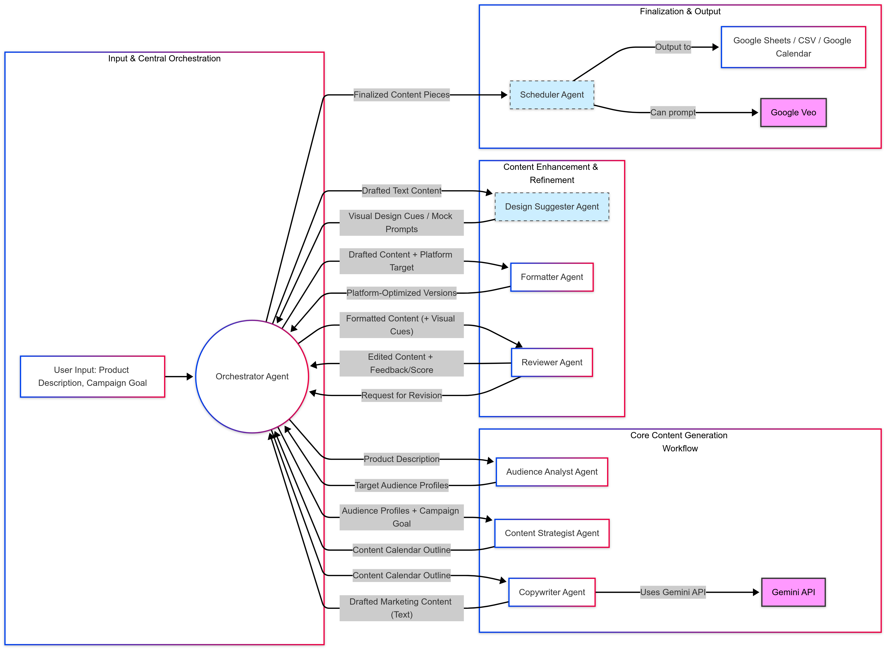

# ContentGenie🧞‍♂️

**AI-Powered Multi-Agent Marketing Content Studio**

**Agent Architecture Diagram**


## Key Features ✨

- **Automated Audience Analysis** - Generates detailed customer personas from product descriptions
- **Intelligent Content Strategy** - Creates data-driven campaign plans tailored to your goals
- **Multi-Platform Copywriting** - Produces optimized content for social media, emails, and ads
- **Design Recommendations** - Suggests visual styles, color palettes, and image concepts
- **AI Image Generation** - Creates custom visuals using Google's Imagen model
- **Content Review & Scoring** - Evaluates tone, clarity, and marketing effectiveness
- **Automated Scheduling** - Generates  ready for your marketing tools
- **Google Cloud Integration** - Saves generated image to Google Cloud Storage, utilizes Google Cloud for API provisioning


## Tech Stack 🛠️

- **Core Framework**: Google Agent Development Kit (ADK)
- **AI Models**: Gemini 1.5 Pro, Imagen 3.0
- **Cloud Services**: Google Cloud Storage, Google Docs/Sheets API
- **Languages**: Python 3.10+
- **Dependencies**: Pillow, google-generativeai, google-cloud-storage

## Getting Started 🚀

### Prerequisites
- Google Cloud account with Vertex AI enabled
- A project on Google Cloud Platform
- Google Cloud CLI
- Python 3.10+ installed
- Valid Google API credentials

### Installation
```bash
# Clone the repository
git clone https://github.com/yourusername/ContentGenie.git
cd ContentGenie

# Create and activate virtual environment
python -m venv .venv
source .venv/bin/activate  # Linux/Mac
.venv\Scripts\activate.bat  # Windows

# Download necessary dependencies
pip install google-adk
pip install litellm
pip install ipython
pip install pillow
pip install google-cloud-storage
pip install google-generativeai
```

### Configuration
Rename .env.example to .env

Add your Google Cloud credentials:

GOOGLE_CLOUD_PROJECT=your-project-id
GOOGLE_CLOUD_LOCATION=your-region
GCS_BUCKET_NAME=your-bucket-name
GOOGLE_API_KEY=your-api-key

Authenticate your GCloud account:
```bash
gcloud auth application-default login
gcloud auth application-default set-quota-project $GOOGLE_CLOUD_PROJECT
```

### Usage 🖥️

Command Line Interface
```bash
# Run the agent system
adk run agents

# Or launch web interface
adk web
```

### Team 👥
# Team Member A [Lee Shao Yuan - https://github.com/Ser1ou5ly]: Quality Assurance & Scheduling
**Agents Owned:**
- **Reviewer Agent**: Performs content quality checks (grammar, tone, marketing effectiveness)
- **Scheduler Agent**: Generates content calendars (Google Sheets/CSV output)

# Team Member B [Clarisse Hooi Wai Leng - https://github.com/Clarisse1007]: Audience & Content Specialist
**Agents Owned:**
- **Audience Analyst Agent**: Generates detailed customer personas
- **Copywriter Agent**: Creates platform-optimized marketing copy
- **Image Generator Agent**: Produces AI visuals from text prompts

# Team Member C [Charmaine Hooi Wai Yee - https://github.com/charrr1103]: System Architect & Strategist
**Agents Owned:**
- **Orchestrator Agent**: Manages end-to-end workflow
- **Content Strategist Agent**: Develops campaign plans
- **Design Suggester Agent**: Recommends visual styles


